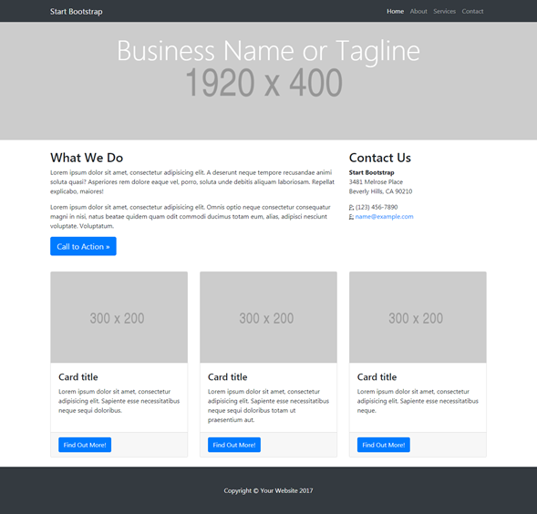
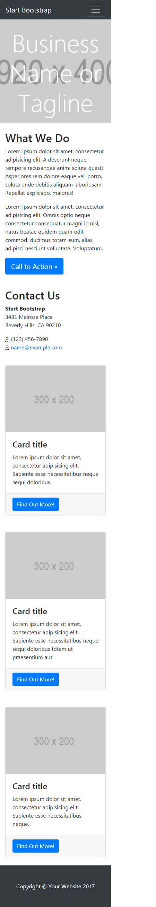

# MI PAGIMA

- Objetivo:

Realizar el diseño de una pagina responsive usando grid.

.

1. Crearemos nuestras carpetas y Archivos.
 - En nuetro Archivo html colocaremos la estructura de la pag. web:
 - Contiene los Enlaces, un header, sección de contenido y un footer.
 - Cada contenido tendra sus propias filas y columnas, cuando le demos otras medidas o lo veamos en otro dispositivo estas cambien de posicion y estilo.

 2. Despues de haber enlasado nuestro Archivo main.css comenzaremos dando estilos a la pagina.
 3. En nuestro Archivo grid.css colocaremos las medidas de las columnas y nuestras media query.
 - Con "@media screen and ()" estableseremos la medida maxima ala que la pagina comensara a realizar los cambios de posicion de su contenido.  

 .
